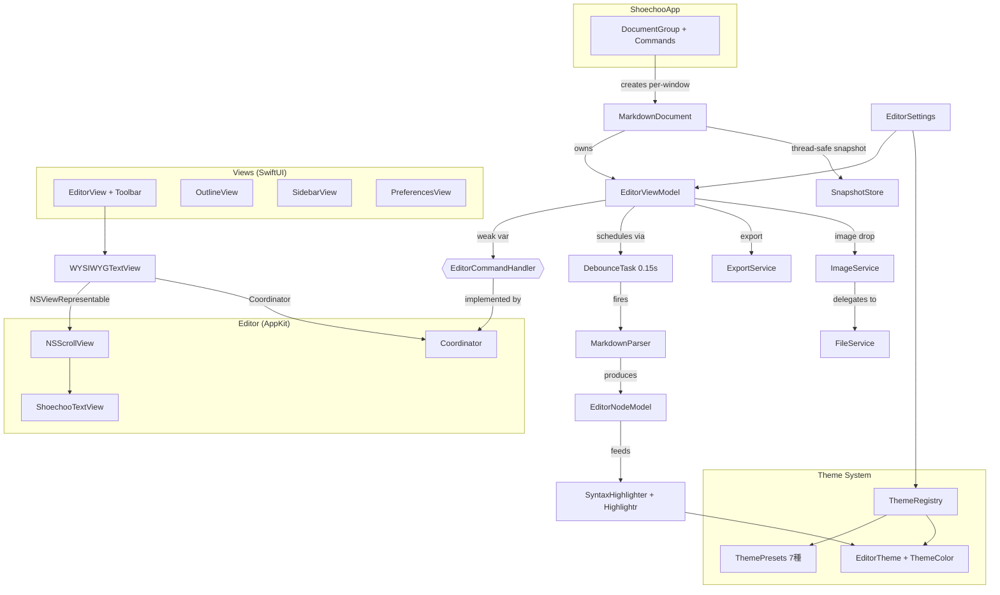
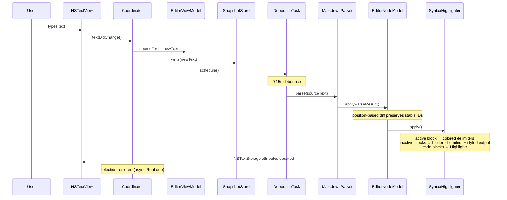
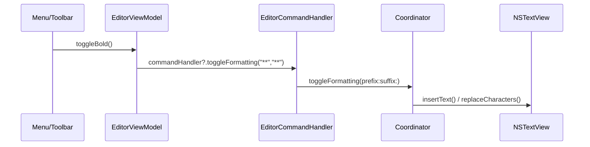

# Architecture

## Project Overview

Shoechoo (集中) is a distraction-free Markdown editor for macOS. It provides a WYSIWYG-style editing experience where the active block shows raw Markdown source while inactive blocks display styled output. The app supports focus mode, typewriter scrolling, image drag-and-drop, theming (7 presets), and export to HTML/PDF.

## Tech Stack

| Layer | Technology |
|-------|-----------|
| UI framework | SwiftUI (scene/window management, preferences, toolbar) |
| Text editing | AppKit `NSTextView` via `NSViewRepresentable` |
| Text engine | TextKit 2 (macOS 14+ default) with `NSTextStorage`-based attribute operations |
| Markdown parsing | [swift-markdown](https://github.com/swiftlang/swift-markdown) (`Document`, `MarkupWalker`) |
| Syntax highlighting | [Highlightr](https://github.com/nicklama/Highlightr) (code blocks, theme-linked) |
| PDF generation | WebKit `WKWebView.pdf(configuration:)` |
| Persistence | `ReferenceFileDocument` (SwiftUI document model) |
| Settings | `UserDefaults` via `@Observable` singleton |

## Architecture Diagram



## Directory Structure

```
shoechoo/
├── App/
│   ├── ShoechooApp.swift          # @main entry, DocumentGroup, menu commands
│   └── MarkdownDocument.swift     # ReferenceFileDocument, SnapshotStore for file I/O
├── Models/
│   ├── EditorNode.swift           # BlockKind, InlineType, EditorNode value type
│   ├── EditorNodeModel.swift      # @Observable block list with diff/merge and active-block tracking
│   ├── EditorSettings.swift       # UserDefaults-backed @Observable singleton
│   ├── EditorViewModel.swift      # @MainActor central coordinator: parse, highlight, format, export
│   ├── EditorCommandHandler.swift # Protocol: 5 type-safe command methods (replaces NotificationCenter)
│   ├── DebounceTask.swift         # @MainActor Task-based debounce (replaces Timer)
│   ├── DocumentStatistics.swift   # Sendable struct: word/char/line counts
│   ├── SnapshotStore.swift        # final class Sendable: NSLock-protected thread-safe snapshot
│   └── ParseResult.swift          # Parser output container
├── Parser/
│   └── MarkdownParser.swift       # swift-markdown AST → [EditorNode]
├── Renderer/
│   └── SyntaxHighlighter.swift    # @MainActor struct: EditorNode → NSTextStorage attributes (Highlightr for code)
├── Editor/
│   ├── ShoechooTextView.swift     # NSTextView subclass: focus dimming, typewriter scroll, D&D
│   └── WYSIWYGTextView.swift      # NSViewRepresentable + Coordinator (implements EditorCommandHandler)
├── Views/
│   ├── EditorView.swift           # Main editor scene with toolbar
│   ├── OutlineView.swift          # Document outline / heading navigator
│   ├── SidebarView.swift          # Recent files list
│   └── PreferencesView.swift      # Settings UI (font, appearance, theme)
├── Theme/
│   ├── EditorTheme.swift          # ThemeColor value type + EditorTheme struct (Codable, Sendable)
│   ├── ThemePresets.swift         # 7 presets: GitHub, Newsprint, Night, Pixyll, Whitey, Solarized Light/Dark
│   └── ThemeRegistry.swift        # @Observable registry: resolves active theme from EditorSettings.themeId
├── Services/
│   ├── ExportService.swift        # actor: HTML generation (MarkupWalker) + PDF via WKWebView
│   ├── FileService.swift          # actor: atomic file writes, directory creation
│   └── ImageService.swift         # actor: image import, filename generation, path validation
└── Resources/
    ├── Info.plist
    └── shoechoo.entitlements
```

## Key Components

### Document Model

`MarkdownDocument` is a `ReferenceFileDocument` (`@unchecked Sendable`) that owns an `EditorViewModel`. Thread-safe file I/O uses `SnapshotStore` -- a `final class Sendable` that guards a snapshot string with `NSLock`. Each document window gets its own view model instance. An assets directory (`<filename>.assets/`) sits alongside the document for embedded images.

### EditorCommandHandler Protocol

Type-safe command dispatch replacing `NotificationCenter`. Five `@MainActor` methods:

| Method | Purpose |
|--------|---------|
| `toggleFormatting(prefix:suffix:)` | Bold, italic, inline code |
| `insertFormattedText(_:cursorOffset:)` | Links, templates |
| `setLinePrefix(_:)` | Headings, list markers |
| `insertImageMarkdown(_:at:)` | Image insertion at position |
| `scrollToPosition(_:)` | Outline navigation |

`EditorViewModel` holds `weak var commandHandler: EditorCommandHandler?`. `WYSIWYGTextView.Coordinator` implements the protocol and operates directly on `NSTextView`.

### Parser

`MarkdownParser` is a `Sendable` struct that wraps `swift-markdown`'s `Document(parsing:)`. It converts the AST into a flat array of `EditorNode` values, each tagged with a `BlockKind` (heading, paragraph, code block, list, table, etc.) and carrying `InlineRun` spans for bold, italic, links, and other inline formatting. Source ranges map back to the original text for cursor-aware editing.

### SyntaxHighlighter

`SyntaxHighlighter` is a `@MainActor` struct that applies `NSTextStorage` attributes to `EditorNode` blocks via two paths:

- **Inactive blocks**: styled output where Markdown syntax delimiters are hidden (font size 0.01, foreground color matches background) and visual formatting is applied (bold fonts, heading sizes, syntax-highlighted code via Highlightr, colored links).
- **Active blocks**: raw Markdown source with subtle syntax coloring on delimiters (`**`, `` ` ``, `#`, etc.) so the user can edit the source directly.

All changes are attribute-only -- the underlying text content in `NSTextStorage` is never modified. Attribute updates are wrapped in `textStorage.beginEditing()`/`endEditing()` to prevent undo registration. Highlightr's theme is synchronized with the active `EditorTheme.highlightrTheme`.

### Editor

`ShoechooTextView` extends `NSTextView` with three features: focus-mode dimming (non-active blocks fade via `focusDimOpacity`), typewriter scrolling (current line stays vertically centered), and image drag-and-drop. `WYSIWYGTextView` wraps it in `NSViewRepresentable` with a `Coordinator` that:

1. Bridges `NSTextViewDelegate` callbacks to the view model
2. Implements `EditorCommandHandler` to receive type-safe formatting commands
3. Manages `EditorNodeModel` for active-block tracking and focus mode
4. Owns a `DebounceTask` for scheduling parse operations

### Theme System

The theme system consists of three layers:

- **`EditorTheme`**: A `Codable`, `Sendable` struct defining all color/font tokens (background, text, headings H1-H6, links, blockquotes, code, delimiters, cursor, selection, focus dim opacity). Uses `ThemeColor` value type with hex and RGBA initializers.
- **`ThemePresets`**: Seven built-in themes -- GitHub, Newsprint, Night, Pixyll, Whitey, Solarized Light, Solarized Dark. Each specifies a matching `highlightrTheme` name for code block syntax highlighting.
- **`ThemeRegistry`**: An `@Observable @MainActor` class that resolves the active theme from `EditorSettings.themeId`.

### Export Pipeline

`ExportService` is an `actor` with two stages:

1. **HTML**: A custom `HTMLConverter` (implementing `MarkupWalker`) walks the swift-markdown AST and produces a standalone HTML page with embedded CSS.
2. **PDF**: The HTML is loaded into an offscreen `WKWebView`, rendered, then exported as A4 PDF data via `WKWebView.pdf(configuration:)`.

### DocumentStatistics

A `Sendable` struct that computes word count, character count, and line count from a source string. Extracted from `EditorViewModel` for separation of concerns.

## Data Flow

### Editing Flow



### Command Flow



Cursor movement follows a parallel path: `textViewDidChangeSelection` updates `cursorPosition`, which resolves the active block via `EditorNodeModel.resolveActiveBlock()`. Changed block IDs trigger selective re-highlighting.

## Concurrency Model

| Component | Isolation | Rationale |
|-----------|-----------|-----------|
| `EditorViewModel` | `@MainActor` | Drives UI state; all property access is on the main thread |
| `EditorSettings` | `@MainActor` | Shared singleton accessed by views and view model |
| `EditorNodeModel` | `@Observable @MainActor` | Block list mutated in main-thread context via the view model |
| `MarkdownParser` | `Sendable` struct | Stateless; safe to call from any context |
| `SyntaxHighlighter` | `@MainActor` struct | Accesses Highlightr's JSContext (not thread-safe) |
| `MarkdownDocument` | `@unchecked Sendable` | `SnapshotStore` for thread-safe snapshot; `viewModel` accessed on `@MainActor` |
| `SnapshotStore` | `final class Sendable` | `NSLock`-guarded private storage; called from any isolation domain |
| `DebounceTask` | `@MainActor` class | Task-based debounce; cancels previous task on each schedule |
| `DocumentStatistics` | `Sendable` struct | Immutable value; safe to pass across boundaries |
| `EditorTheme` / `ThemeColor` | `Sendable` struct | Immutable value types |
| `ThemeRegistry` | `@Observable @MainActor` | Resolves active theme; accessed by views |
| `ExportService` | `actor` | PDF generation involves async WebKit calls |
| `FileService` | `actor` | File system operations serialized to avoid races |
| `ImageService` | `actor` | Image import delegates to `FileService` |

Parse scheduling uses `DebounceTask`, which wraps `Task.sleep(for: .seconds(0.15))`. Each new keystroke cancels the previous parse task, ensuring only the latest revision is applied. Stale results are discarded via `EditorNodeModel`'s revision counter.

## Design Decisions

### NSTextView over SwiftUI TextEditor

SwiftUI's `TextEditor` lacks fine-grained control over attributed string rendering, text storage manipulation, and selection management. `NSTextView` provides direct access to `NSTextStorage` for applying per-block styling, custom drag-and-drop handling, and IME composition awareness (`hasMarkedText()`).

### EditorCommandHandler over NotificationCenter

The original design used `NotificationCenter` notifications (`toggleFormatting`, `insertFormattedText`, `setLinePrefix`) for communication between SwiftUI menu commands and the AppKit `Coordinator`. This was replaced by the `EditorCommandHandler` protocol for type safety, compile-time verification, and per-document-window targeting (no broadcast semantics). `EditorViewModel` holds a `weak var commandHandler` set by `Coordinator` during view creation.

### DebounceTask over Timer

`Timer` required `nonisolated(unsafe)` properties to bridge between `@MainActor` and the timer callback. `DebounceTask` uses structured `Task` with `Task.sleep` and cancellation, eliminating all `nonisolated(unsafe)` usage within the Coordinator.

### SnapshotStore over inline NSLock

`MarkdownDocument` needs thread-safe snapshot access from `nonisolated` methods (`snapshot(contentType:)`, `fileWrapper(snapshot:configuration:)`) while the view model writes on `@MainActor`. `SnapshotStore` encapsulates the `NSLock` + `nonisolated(unsafe)` pattern in a dedicated `Sendable` class, keeping `MarkdownDocument` clean.

### Dual rendering paths (active vs. inactive)

The active block shows raw Markdown so the user always edits plain text. Inactive blocks render styled output for a live-preview feel. This avoids the complexity of a true rich-text editor while still providing visual feedback.

### Block-level architecture with stable IDs

The document is parsed into a flat list of `EditorNode` blocks rather than maintaining a persistent tree. `EditorNodeModel.applyParseResult()` performs a position-based diff that preserves UUIDs for unchanged blocks, enabling selective re-highlighting of only modified content.

### Theme-linked Highlightr

Each `EditorTheme` specifies a `highlightrTheme` name (e.g., `"github"`, `"monokai-sublime"`, `"solarized-dark"`). When the active theme changes, `SyntaxHighlighter` updates Highlightr's theme to match, ensuring code blocks visually integrate with the surrounding editor theme.

### Actor-based services

`ExportService`, `FileService`, and `ImageService` are Swift `actor` types, serializing I/O operations and ensuring thread safety without manual locking. The export pipeline chains HTML generation (CPU-bound) with PDF rendering (async WebKit), both isolated within the actor.
