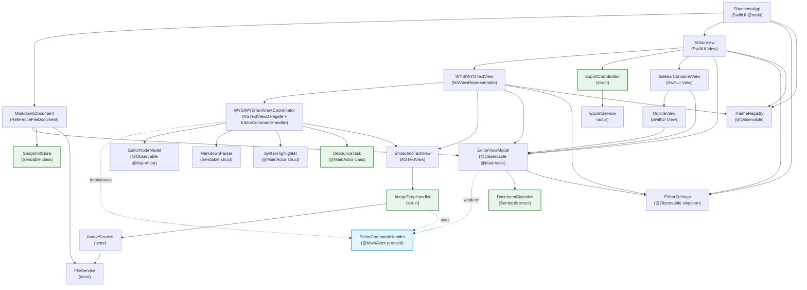

# Component Dependencies — Cycle 2: Refactoring

> リファクタリング前後の依存関係を対比。
> NotificationCenter 依存の完全排除と新規コンポーネントの依存を図示する。

---

## 依存グラフ（リファクタリング後）



> **凡例**: 青 = 新規 protocol、緑 = 新規 struct/class、点線 = protocol 実装/weak 参照

---

## 依存マトリクス（リファクタリング後）

| コンポーネント | 依存先 | 被依存元 |
|---------------|--------|---------|
| ShoechooApp | MarkdownDocument, EditorSettings, ThemeRegistry, EditorView | -- (entry point) |
| MarkdownDocument | EditorViewModel, SnapshotStore, FileService | ShoechooApp |
| EditorViewModel | EditorSettings, DocumentStatistics, EditorCommandHandler (weak) | MarkdownDocument, EditorView, WYSIWYGTextView, OutlineView |
| **EditorCommandHandler** | -- (protocol) | EditorViewModel (weak ref), Coordinator (implements), ImageDropHandler, OutlineView (via ViewModel) |
| **DocumentStatistics** | -- | EditorViewModel |
| **ExportCoordinator** | ExportService | EditorView |
| **ImageDropHandler** | ImageService, EditorCommandHandler | ShoechooTextView |
| **DebounceTask** | -- | Coordinator |
| **SnapshotStore** | -- | MarkdownDocument |
| WYSIWYGTextView | Coordinator, ShoechooTextView, EditorViewModel, EditorSettings, ThemeRegistry | EditorView |
| Coordinator | EditorNodeModel, MarkdownParser, SyntaxHighlighter, DebounceTask, ShoechooTextView | WYSIWYGTextView |
| EditorSettings | -- | ShoechooApp, EditorViewModel, WYSIWYGTextView, Coordinator, EditorView |
| ThemeRegistry | EditorSettings | ShoechooApp, WYSIWYGTextView, EditorView |
| MarkdownParser | -- (swift-markdown) | Coordinator |
| EditorNodeModel | -- | Coordinator |
| SyntaxHighlighter | -- | Coordinator |
| ExportService | -- (swift-markdown, WebKit) | ExportCoordinator |
| ImageService | FileService | ImageDropHandler |
| FileService | -- | ImageService, MarkdownDocument |
| ShoechooTextView | ImageDropHandler | WYSIWYGTextView, Coordinator |
| OutlineView | EditorViewModel | SidebarContainerView |

---

## 現在 → リファクタリング後の変更点

### 1. NotificationCenter 依存の完全排除

| 通知名 | 発信元（現在） | 受信元（現在） | 置換先 |
|--------|-------------|-------------|--------|
| `.toggleFormatting` | EditorViewModel.swift:143 | Coordinator.swift:306-314 | `EditorCommandHandler.toggleFormatting()` |
| `.insertFormattedText` | EditorViewModel.swift:150 | Coordinator.swift:315-321 | `EditorCommandHandler.insertFormattedText()` |
| `.setLinePrefix` | EditorViewModel.swift:157 | Coordinator.swift:324-330 | `EditorCommandHandler.setLinePrefix()` |
| `.insertImageMarkdown` | EditorViewModel.swift:114 | **受信ハンドラなし (BUG)** | `EditorCommandHandler.insertImageMarkdown()` |
| `.scrollToPosition` | OutlineView.swift:39 | Coordinator.swift:332-339 | `EditorCommandHandler.scrollToPosition()` |

**排除される import/依存**:
- `NotificationCenter.default.post(name:object:userInfo:)` — EditorViewModel 内 4 箇所
- `NotificationCenter.default.addObserver(forName:object:queue:)` — Coordinator 内 4 箇所
- `NotificationCenter.default.removeObserver()` — Coordinator.deinit 内 1 箇所
- `NotificationCenter.default.post(name: .scrollToPosition)` — OutlineView 内 1 箇所
- `Notification.Name` extension — EditorViewModel.swift:163-169 の 5 定義

**合計**: NotificationCenter 参照 **10 箇所 → 0 箇所**

### 2. nonisolated(unsafe) の完全排除

| 箇所 | ファイル:行 | 解消方法 |
|------|-----------|---------|
| `highlightTimer: Timer?` | WYSIWYGTextView.swift:101 | DebounceTask に置換 |
| `autoSaveTimer: Timer?` | WYSIWYGTextView.swift:102 | DebounceTask に置換 |
| `notificationObservers: [any NSObjectProtocol]` | WYSIWYGTextView.swift:103 | Notification 廃止により削除 |
| `var viewModel: EditorViewModel` | MarkdownDocument.swift:13 | `@MainActor var viewModel` に変更 |
| `private let lock = NSLock()` | MarkdownDocument.swift:17 | SnapshotStore に集約 |
| `private var _snapshotText: String` | MarkdownDocument.swift:18 | SnapshotStore に集約 |
| `var fileURL: URL?` | MarkdownDocument.swift:52 | `@MainActor var fileURL` に変更 |

**合計**: `nonisolated(unsafe)` **7 箇所 → 0 箇所**（MarkdownDocument 外部）

> SnapshotStore 内部に 1 箇所の `nonisolated(unsafe) var _text` が残るが、
> これは NSLock で保護された private 実装詳細であり、ReferenceFileDocument の
> nonisolated snapshot 要件を満たすための最小限の unsafe。
> MarkdownDocument の public/internal インターフェースからは完全に排除される。

### 3. 新規依存関係の追加

| 関係 | タイプ | 説明 |
|------|--------|------|
| EditorViewModel → EditorCommandHandler | weak reference | `weak var commandHandler: EditorCommandHandler?` |
| Coordinator → EditorCommandHandler | protocol conformance | `Coordinator: EditorCommandHandler` |
| EditorViewModel → DocumentStatistics | composition | `var statistics: DocumentStatistics` |
| EditorView → ExportCoordinator | usage | エクスポート操作時に生成 |
| ShoechooTextView → ImageDropHandler | usage | 画像D&D時に生成 |
| Coordinator → DebounceTask | composition | `highlightDebounce`, `autoSaveDebounce` の 2 インスタンス |
| MarkdownDocument → SnapshotStore | composition | `let snapshotStore = SnapshotStore()` |
| ImageDropHandler → EditorCommandHandler | parameter | `handleImageDrop(..., commandHandler:)` |
| OutlineView → EditorCommandHandler | indirect (via ViewModel) | `viewModel.commandHandler?.scrollToPosition()` |

### 4. 削除される依存関係

| 関係 | 理由 |
|------|------|
| EditorViewModel → ExportService | ExportCoordinator に移行 |
| EditorViewModel → ImageService | ImageDropHandler に移行 |
| EditorViewModel → NotificationCenter | Protocol/Delegate に移行 |
| Coordinator → NotificationCenter | Protocol/Delegate に移行 |
| OutlineView → NotificationCenter | Protocol/Delegate に移行 |

---

## 通信パターン（リファクタリング後）

| パターン | 使用箇所 | メカニズム |
|---------|---------|-----------|
| Observation | EditorViewModel → EditorView | @Observable / SwiftUI binding |
| Protocol/Delegate | EditorViewModel → Coordinator | EditorCommandHandler protocol (weak ref) |
| Direct call | Coordinator → MarkdownParser | 同期メソッド呼び出し |
| Direct call | Coordinator → EditorNodeModel | 同期メソッド呼び出し |
| Direct call | Coordinator → SyntaxHighlighter | 同期メソッド呼び出し |
| Direct call | OutlineView → EditorViewModel → Coordinator | commandHandler chain |
| Async call | ExportCoordinator → ExportService | async/await (actor) |
| Async call | ImageDropHandler → ImageService | async/await (actor) |
| Composition | MarkdownDocument → SnapshotStore | nonisolated スレッドセーフアクセス |
| Composition | Coordinator → DebounceTask | Task ベースデバウンス |
| Shared ref | ShoechooApp → EditorSettings | @Observable singleton via @Environment |

---

## データフロー（リファクタリング後）

### 編集フロー（変更なし）

```
User types
    |
    v
ShoechooTextView (NSTextView)
    |
    v
Coordinator.textDidChange()
    |
    +---> viewModel.sourceText = newText
    +---> document?.updateSnapshotText(newText)  // → SnapshotStore.write()
    +---> highlightDebounce.schedule(interval: .milliseconds(150)) {
    |         applyHighlightNow()
    |     }
    +---> autoSaveDebounce.schedule(interval: .seconds(N)) {
              performAutoSave()
          }
```

### 書式コマンドフロー（NotificationCenter → Protocol）

```
[現在]                                  [リファクタリング後]

Toolbar: Bold ボタン                     Toolbar: Bold ボタン
    |                                        |
    v                                        v
EditorViewModel.toggleBold()             EditorViewModel.toggleBold()
    |                                        |
    v                                        v
NotificationCenter.post(                 commandHandler?.toggleFormatting(
    name: .toggleFormatting,                 prefix: "**",
    userInfo: ["prefix":"**","suffix":"**"]   suffix: "**"
)                                        )
    |                                        |
    v (broadcast to ALL Coordinators)        v (direct call to THIS Coordinator)
    |                                        |
Coordinator Observer closure             Coordinator.toggleFormatting(prefix:suffix:)
    |                                        |
    v                                        v
NSTextView.insertText()                  NSTextView.insertText()
```

### 画像ドロップフロー（リファクタリング後）

```
User drops image on editor
    |
    v
ShoechooTextView.performDragOperation()
    |
    v
ImageDropHandler.handleImageDrop(
    urls: urls,
    documentURL: documentURL,
    insertionPosition: viewModel.cursorPosition,
    commandHandler: viewModel.commandHandler
)
    |
    v
ImageService.importDroppedImage(from: urls, to: assetsDir)
    |
    +---> FileService.createDirectoryIfNeeded()
    +---> FileService.safeWrite()
    +---> return [relativePath]
    |
    v
commandHandler.insertImageMarkdown("", at: position)
    |
    v
NSTextView にマークダウン構文が挿入される
    |
    v
Normal editing flow (textDidChange → re-parse → re-render)
```

### Outline ナビゲーションフロー（リファクタリング後）

```
[現在]                                  [リファクタリング後]

OutlineView: heading タップ              OutlineView: heading タップ
    |                                        |
    v                                        v
NotificationCenter.post(                 viewModel.commandHandler?.scrollToPosition(
    name: .scrollToPosition,                 heading.position
    userInfo: ["position": N]            )
)                                            |
    |                                        v (direct call to THIS Coordinator)
    v (broadcast)                            |
Coordinator Observer closure             Coordinator.scrollToPosition(_:)
    |                                        |
    v                                        v
NSTextView.setSelectedRange()            NSTextView.setSelectedRange()
NSTextView.scrollRangeToVisible()        NSTextView.scrollRangeToVisible()
```
