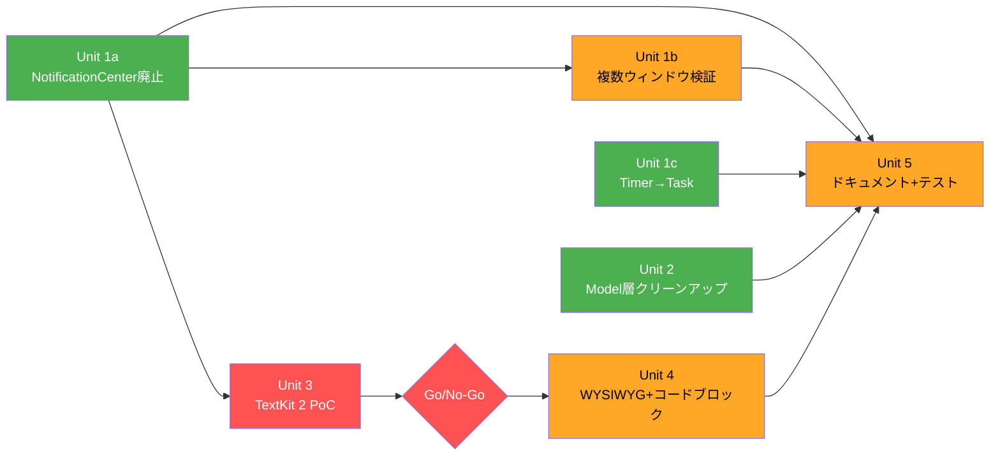

# Unit of Work Dependencies — Cycle 2

## Dependency Graph



**凡例**: 緑=並行開始可、赤=判定ゲート、オレンジ=依存あり

## Dependency Matrix

| Unit | 依存先 | 並行可能 | ブロッカー |
|------|--------|---------|-----------|
| 1a | なし | 即開始可 | — |
| 1b | 1a | 1a完了後 | 1a |
| 1c | なし | 1aと並行可 | — |
| 2 | なし | 1aと並行可 | — |
| 3 | 1a | 1a完了後 | 1a |
| 4 | 3判定 | 3判定後 | 3 Go/No-Go |
| 5 | 1a,1b,1c,2,4 | 全Unit完了後 | 全Unit |

## 並行実行戦略

```
Phase A (並行): Unit 1a + Unit 1c + Unit 2
Phase B (1a完了後): Unit 1b + Unit 3 PoC
Phase C (3判定後): Unit 4
Phase D (全完了後): Unit 5
```

## Per-Unit ビルド検証ゲート

各Unit完了時に必須:
1. `xcodebuild build` — ビルドエラー0
2. `xcodebuild test` — 全テスト通過
3. Unit固有の検証（unit-of-work.md 各Unit の完了基準参照）
4. main へ squash merge
