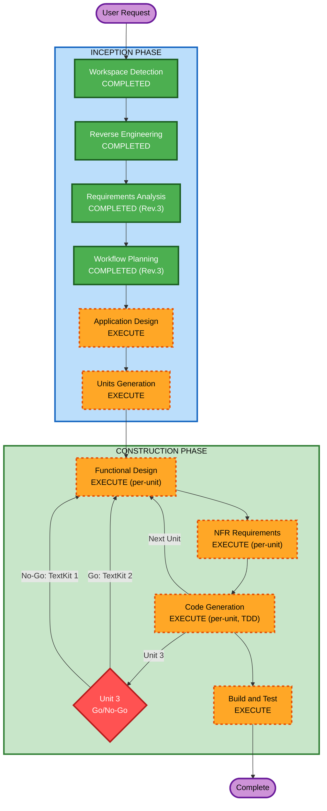

# Execution Plan — Cycle 2: WYSIWYG Editor Refactoring (Rev.3)

## Detailed Analysis Summary

### Transformation Scope
- **Type**: Architectural refactoring (コマンドパターン刷新、TextKit 2移行検討、テスト強化)
- **Source Files**: 21ソース + 6テスト = 27 Swift files
- **Risk Level**: High（TextKit 2はPoCで検証、Unit 1は段階的移行）

### Change Impact
- **User-facing**: Yes — WYSIWYG体験向上、コードブロックハイライト
- **Structural**: Yes — コマンドパターン、ViewModel分割、Timer→Task
- **Data model**: No — EditorNode/ParseResult 維持
- **API**: Yes — EditorViewModel ↔ Coordinator 通信方式変更

## Branch Strategy

- **各Unitごとに feature branch** を作成: `refactor/unit-N-description`
- Unit完了・テスト通過後に main にマージ（squash merge）
- Unit 1はNotification単位でコミット（段階的移行、個別revert可能）
- Unit 3（TextKit 2）は `refactor/unit-3-textkit2-poc` で隔離、Go/No-Go判定後にマージ or 破棄

## Unit Decomposition (Rev.3)

### Unit 1a: NotificationCenter廃止（FR-01 + FR-06）
**Branch**: `refactor/unit-1a-command-handler`

| サブステップ | 内容 | 検証ポイント |
|------------|------|-------------|
| 1a-1 | `EditorCommandHandler` プロトコル定義 + Coordinator実装 | ビルド成功 |
| 1a-2 | `toggleFormatting` をProtocol呼び出しに置換 | ビルド + Bold/Italic/Code テスト |
| 1a-3 | `insertFormattedText` を置換 | ビルド + Link挿入テスト |
| 1a-4 | `setLinePrefix` を置換 | ビルド + Heading設定テスト |
| 1a-5 | `insertImageMarkdown` を置換（FR-06バグ修正） | ビルド + 画像D&Dテスト |
| 1a-6 | `scrollToPosition` を置換 | ビルド + OutlineViewジャンプテスト |
| 1a-7 | 全Notification.Name定義 + NotificationCenter購読を削除 | ビルド + 全テスト通過 |

**ロールバック**: 各サブステップが個別コミット。問題発生時は該当コミットのみrevert。

### Unit 1b: 複数ウィンドウ検証（FR-02）
**Branch**: `refactor/unit-1b-multiwindow`
**依存**: Unit 1a 完了後

- [ ] 2ウィンドウ同時操作テスト（XCUITest）
- [ ] コマンド干渉なしの検証
- [ ] **ビルド検証ゲート**: ビルド成功 + 全テスト通過

### Unit 1c: Timer → Task デバウンス（FR-09）
**Branch**: `refactor/unit-1c-task-debounce`
**依存**: なし（Unit 1aと並行可能）

- [ ] `highlightTimer` → Task ベースデバウンスに置換
- [ ] `autoSaveTimer` → Task ベースデバウンスに置換
- [ ] `notificationObservers` 配列の `nonisolated(unsafe)` 排除（Unit 1a完了後は不要になるため）
- [ ] **ビルド検証ゲート**: ビルド成功 + 全テスト通過 + Coordinator の nonisolated(unsafe) ゼロ

### Unit 2: ViewModel分割 + heading重複解消 + MarkdownDocument unsafe排除（FR-07 + FR-08 + FR-10）
**Branch**: `refactor/unit-2-model-cleanup`
**依存**: なし（Unit 1と並行可能）

- [ ] FR-07: DocumentStatistics 抽出、エクスポート分離、画像ハンドリング分離
- [ ] FR-08: heading抽出ロジックの統合
- [ ] FR-10: MarkdownDocument の nonisolated(unsafe) 4箇所を解消
- [ ] **ビルド検証ゲート**: ビルド成功 + 全テスト通過 + MarkdownDocument の nonisolated(unsafe) ゼロ

### Unit 3: TextKit 2 PoC + Go/No-Go判定（FR-03）
**Branch**: `refactor/unit-3-textkit2-poc`
**依存**: Unit 1a 完了後

- [ ] ベースライン計測（TextKit 1: 1,000行/10,000行ドキュメントのハイライト速度）
- [ ] 最小PoC実装（NSTextContentStorage + NSTextLayoutManager + 簡易ハイライト）
- [ ] IME日本語入力テスト
- [ ] パフォーマンス比較
- [ ] **Go/No-Go判定ゲート**:
  - Go: IME正常 + パフォーマンス80%以上 → 本実装に進む
  - No-Go: IME問題 or パフォーマンス20%以上劣化 → ブランチ破棄、TextKit 1で継続

### Unit 4: WYSIWYG体験向上 + コードブロックハイライト（FR-04 + FR-05）
**Branch**: `refactor/unit-4-wysiwyg-highlight`
**依存**: Unit 3 判定後

- [ ] FR-04: 差分ハイライト、ちらつき軽減、インクリメンタルハイライト
- [ ] FR-05: Highlightr評価 → コードブロックハイライト統合
- [ ] **ビルド検証ゲート**: ビルド成功 + 全テスト通過

### Unit 5: ARCHITECTURE.md再設計 + テスト補完（FR-11 + NFR残件）
**Branch**: `refactor/unit-5-docs-tests`
**依存**: Unit 1-4 完了後

- [ ] FR-11: ARCHITECTURE.md を実装に合わせて全面改訂
- [ ] テストカバレッジ80%達成に向けた残テスト追加
- [ ] CLAUDE.md のNSRangeルール更新（TextKit 2移行時）
- [ ] **最終検証ゲート**: ビルド成功 + 全テスト通過 + カバレッジ80%+

## Unit間の並行実行可能性

```
          Unit 1a (NotificationCenter廃止)
            │
            ├──→ Unit 1b (複数ウィンドウ検証)
            │
            └──→ Unit 3 (TextKit 2 PoC) ──→ [Go/No-Go]
                                                │
     Unit 1c (Timer→Task) ── 並行可 ────────────┤
                                                │
     Unit 2 (Model cleanup) ── 並行可 ──────────┤
                                                │
                                                └──→ Unit 4 (WYSIWYG + コードブロック)
                                                        │
                                                        └──→ Unit 5 (ドキュメント + テスト)
```

## Per-Unit ビルド検証ゲート

**各Unit完了時に必須**:
1. `xcodebuild -scheme shoechoo build` — ビルドエラー0
2. `xcodebuild -scheme shoechoo test` — 全テスト通過
3. Unit固有の検証（上記各Unitに記載）

失敗時はUnit内で修正。前Unitのバグが発覚した場合は該当Unitのブランチに戻って修正。

## Workflow Visualization



## Phases

### INCEPTION PHASE
- [x] Workspace Detection
- [x] Reverse Engineering (10 artifacts)
- [x] Requirements Analysis (Rev.3: 11 FR + 7 NFR + 12 AC)
- [x] User Stories (SKIP)
- [x] Workflow Planning (Rev.3)
- [ ] Application Design — **EXECUTE**
  - 成果物: EditorCommandHandler プロトコル設計、TextKit 2コンポーネント設計、ViewModel分割設計
  - 完了基準: 全FRの技術設計が文書化され、レビュー承認
- [ ] Units Generation — **EXECUTE**
  - 成果物: Unit 1a-5 の詳細タスクリスト、依存関係図、ブランチ名
  - 完了基準: 全Unitの作業項目が具体化

### CONSTRUCTION PHASE
- [ ] Functional Design — **EXECUTE** (per-unit)
- [ ] NFR Requirements — **EXECUTE** (per-unit)
- [ ] NFR Design — **SKIP**
- [ ] Infrastructure Design — **SKIP**
- [ ] Code Generation — **EXECUTE** (per-unit, TDD並行)
- [ ] Build and Test — **EXECUTE**

## Success Criteria

requirements.md の Acceptance Criteria 全12項目を参照:

1. NotificationCenter 通知が0件
2. 複数ウィンドウ独立動作（XCUITest検証済み）
3. TextKit 2 or TextKit 1 安定動作
4. テストカバレッジ 80%+
5. コードブロックハイライト動作
6. ARCHITECTURE.md 実装一致
7. 画像D&D→Markdown挿入正常動作
8. TD-01〜TD-08, TD-10 解消
9. nonisolated(unsafe) ゼロ
10. ビルドエラー0、テスト全通過
11. macOS 14+ 動作確認
12. NFR-03 パフォーマンス基準クリア
