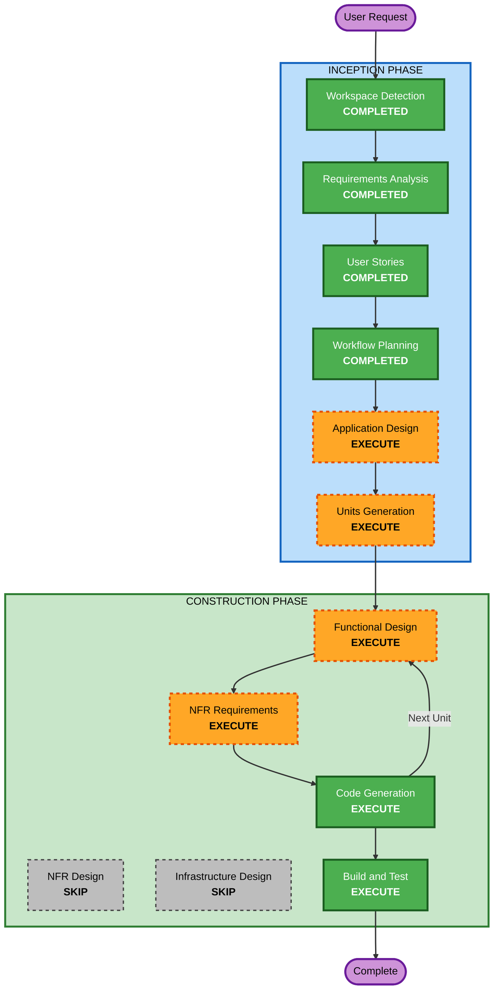

# Execution Plan: Shoe Choo

## Detailed Analysis Summary

### Change Impact Assessment
- **User-facing changes**: Yes — entire application is user-facing (WYSIWYG editor, focus mode, export, sidebar)
- **Structural changes**: Yes — new macOS application with MVVM architecture, TextKit 2 editor engine
- **Data model changes**: Yes — document model, editor state, image asset management
- **API changes**: N/A — desktop app, no external APIs
- **NFR impact**: Yes — performance (sub-16ms keystroke latency), security (App Sandbox, Hardened Runtime)

### Risk Assessment
- **Risk Level**: Medium — TextKit 2 WYSIWYG rendering is the primary technical risk; well-understood NSDocument and SwiftUI patterns reduce other risks
- **Rollback Complexity**: Easy — greenfield project, no existing users
- **Testing Complexity**: Moderate — WYSIWYG rendering requires visual verification; parser/export/file operations are unit-testable

---

## Workflow Visualization



### Text Alternative
```
Phase 1: INCEPTION
  - Workspace Detection (COMPLETED)
  - Requirements Analysis (COMPLETED)
  - User Stories (COMPLETED)
  - Workflow Planning (COMPLETED)
  - Application Design (EXECUTE)
  - Units Generation (EXECUTE)

Phase 2: CONSTRUCTION (per-unit loop)
  - Functional Design (EXECUTE, per-unit)
  - NFR Requirements (EXECUTE, per-unit)
  - NFR Design (SKIP)
  - Infrastructure Design (SKIP)
  - Code Generation (EXECUTE, per-unit)
  - Build and Test (EXECUTE)
```

---

## Phases to Execute

### INCEPTION PHASE
- [x] Workspace Detection (COMPLETED)
- [x] Requirements Analysis (COMPLETED)
- [x] User Stories (COMPLETED)
- [x] Workflow Planning (COMPLETED)
- [ ] Application Design - **EXECUTE**
  - **Rationale**: New application requires component identification, service layer design, and dependency mapping. 8 epics with 26 stories need structured component architecture.
- [ ] Units Generation - **EXECUTE**
  - **Rationale**: Complex project with multiple subsystems (editor engine, document management, export, sidebar) benefits from decomposition into parallel units of work.

### CONSTRUCTION PHASE (per-unit)
- [ ] Functional Design - **EXECUTE**
  - **Rationale**: TextKit 2 WYSIWYG engine requires detailed business logic design. Document model, parser integration, and rendering pipeline need formal specification before code generation.
- [ ] NFR Requirements - **EXECUTE**
  - **Rationale**: Performance targets (sub-16ms latency, <50MB memory), App Sandbox entitlements, and Hardened Runtime require explicit NFR specification. Security Baseline extension is enabled.
- [ ] NFR Design - **SKIP**
  - **Rationale**: Desktop macOS app with no cloud infrastructure. NFR patterns (caching, scaling) are straightforward for a native app — performance optimization can be addressed during implementation.
- [ ] Infrastructure Design - **SKIP**
  - **Rationale**: No cloud infrastructure, no server deployment. Distribution is via GitHub Releases with notarization — handled in Build and Test.
- [ ] Code Generation - **EXECUTE** (ALWAYS)
  - **Rationale**: Implementation planning and Swift/SwiftUI code generation for all units.
- [ ] Build and Test - **EXECUTE** (ALWAYS)
  - **Rationale**: Xcode build, XCTest/Swift Testing, notarization instructions.

### OPERATIONS PHASE
- [ ] Operations - PLACEHOLDER
  - **Rationale**: Future deployment and monitoring workflows.

---

## Tool Strategy (per ツール比較)

Based on the spec-driven development tool comparison, the recommended tools per phase:

| Phase | Primary Tool | Support Tool |
|-------|-------------|--------------|
| Application Design | AI-DLC (this workflow) | — |
| Units Generation | AI-DLC | — |
| Functional Design | AI-DLC | tsumiki:kairo-design (design verification) |
| NFR Requirements | AI-DLC | — |
| Code Generation | AI-DLC + tsumiki:kairo-tasks (task splitting) | superpowers:using-git-worktrees (isolation) |
| TDD Implementation | tsumiki:kairo-loop (auto TDD) | tsumiki:tdd-red/green/refactor |
| Review | superpowers:code-reviewer | ECC:swift-reviewer (if available) |
| Build & Test | AI-DLC | tsumiki:auto-debug (error resolution) |

**Transition Point**: After AI-DLC Code Generation planning (Part 1), switch to **tsumiki:kairo-tasks** for 1-day granularity task splitting, then **tsumiki:kairo-loop** for automated TDD implementation.

---

## Success Criteria
- **Primary Goal**: Working MVP of Shoe Choo with WYSIWYG editing, focus mode, and export
- **Key Deliverables**:
  - Xcode project with SwiftUI + AppKit app
  - TextKit 2 WYSIWYG Markdown editor
  - Focus mode and typewriter scrolling
  - NSDocument-based file management
  - HTML and PDF export
  - App Sandbox + Hardened Runtime + Developer ID signing
- **Quality Gates**:
  - All unit tests passing (parser, document model, export)
  - App Sandbox entitlements validated
  - Notarization successful
  - Cold launch < 1 second
  - Memory < 50MB on typical documents
