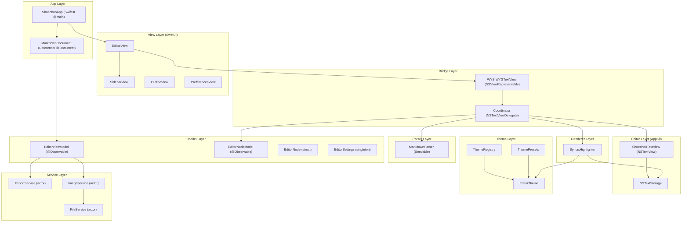
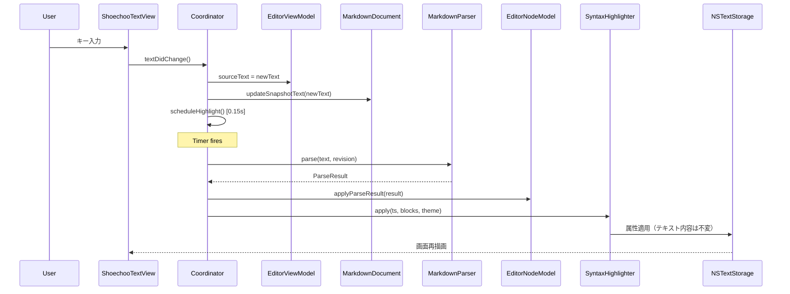

# Architecture — shoechoo (Reverse Engineering)

## システム全体概要

shoechoo は macOS ネイティブの Document-Based Application 上に構築された WYSIWYG Markdown エディタ。SwiftUI の DocumentGroup をエントリーポイントとし、テキスト編集は AppKit NSTextView に委譲。swift-markdown でソースをブロックツリーに変換し、SyntaxHighlighter がブロック状態に応じて NSTextStorage に属性を適用することで WYSIWYG 表示を実現。

## アーキテクチャ図

## コンポーネント記述

| コンポーネント | 目的 | 依存関係 | タイプ |
|---------------|------|---------|-------|
| ShoechooApp | エントリーポイント、DocumentGroup、メニュー | EditorSettings, ThemeRegistry | SwiftUI App |
| MarkdownDocument | ファイルI/O、snapshot管理 | EditorViewModel | ReferenceFileDocument |
| EditorViewModel | エディタ状態一元管理 | EditorSettings, NotificationCenter | @Observable @MainActor |
| EditorNodeModel | ブロックツリー管理、差分マージ | EditorNode | @Observable |
| MarkdownParser | AST→EditorNode変換 | swift-markdown | Sendable struct |
| SyntaxHighlighter | NSTextStorage属性適用 | EditorTheme, EditorNode | @MainActor struct |
| ShoechooTextView | カスタムNSTextView | EditorViewModel | NSTextView subclass |
| WYSIWYGTextView | SwiftUI↔AppKitブリッジ | 全レイヤー | NSViewRepresentable |
| ExportService | HTML/PDFエクスポート | swift-markdown, WebKit | actor |
| FileService | ファイル操作 | FileManager | actor |
| ImageService | 画像インポート | FileService | actor |

## データフロー

## 統合ポイント

| 統合先 | 用途 | 箇所 |
|--------|------|------|
| swift-markdown 0.5.0 | Markdown パーサ、HTML変換 | MarkdownParser, ExportService |
| Highlightr 2.2.1 | コードブロックハイライト（宣言のみ、未使用） | project.yml |
| WebKit (WKWebView) | PDFエクスポート | ExportService |
| AppKit (NSTextView) | 中核エディタ | ShoechooTextView |
| SwiftUI (DocumentGroup) | ドキュメントベースアプリ構造 | ShoechooApp |

## 発見された問題

1. **insertImageMarkdown 通知の Observer 未登録**: `EditorViewModel.insertImage()` が `.insertImageMarkdown` をpostするが、`Coordinator.registerNotifications()` にObserverがない → 画像D&D後にMarkdown構文が挿入されない
2. **Highlightr 未使用**: project.yml で依存宣言されているが、コード内で直接利用されていない
