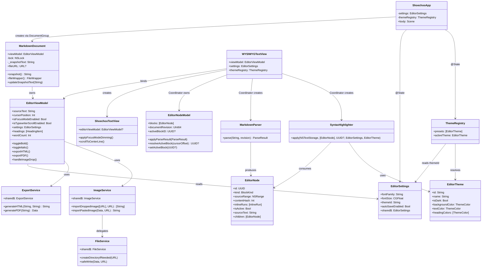

# Code Structure

## Build System

| Item | Detail |
|------|--------|
| Build tool | Xcode 16+ via **XcodeGen** |
| Config file | `project.yml` |
| Swift version | 6.0 (strict concurrency: `complete`) |
| Deployment target | macOS 14.0 |
| Scheme | `shoechoo` (app + tests, coverage enabled) |

XcodeGen generates the `.xcodeproj` from `project.yml`. The project defines two targets:
- `shoechoo` (application) -- sources from `shoechoo/`, resources from `shoechoo/Resources/`
- `shoechooTests` (unit test bundle) -- sources from `shoechooTests/`, depends on `shoechoo`

## Source File Inventory

### App Layer (2 files, 207 lines)

| File | Lines | Purpose |
|------|-------|---------|
| `shoechoo/App/ShoechooApp.swift` | 137 | `@main` entry point. `DocumentGroup` scene, menu commands (Format, Heading, Focus, Export, Sidebar), `FocusedValueKey` for `EditorViewModel` |
| `shoechoo/App/MarkdownDocument.swift` | 70 | `ReferenceFileDocument` implementation. Owns `EditorViewModel`. Thread-safe snapshot via `NSLock`. Assets directory management |

### Models Layer (4 files, 350 lines)

| File | Lines | Purpose |
|------|-------|---------|
| `shoechoo/Models/EditorNode.swift` | 99 | Value types: `BlockKind` enum (paragraph, heading, codeBlock, list, table, etc.), `InlineRun`/`InlineType` for inline formatting, `EditorNode` struct with source range, activation scope |
| `shoechoo/Models/EditorNodeModel.swift` | 115 | `@Observable @MainActor` block list manager. Position-based diff preserving stable UUIDs, active block resolution by cursor offset, block lookup |
| `shoechoo/Models/EditorSettings.swift` | 59 | `@Observable @MainActor` singleton. UserDefaults-backed settings: font, spacing, appearance, theme, focus mode, typewriter scroll, auto-save |
| `shoechoo/Models/EditorViewModel.swift` | 169 | Central coordinator. `@Observable @MainActor`. Manages `sourceText`, cursor position, formatting commands (bold/italic/code/link/heading), outline headings, word/char/line stats, export, image drop. Communicates with NSTextView via `NotificationCenter` |
| `shoechoo/Models/ParseResult.swift` | 7 | Simple `Sendable` struct wrapping `revision` + `[EditorNode]` |

### Parser Layer (1 file, 238 lines)

| File | Lines | Purpose |
|------|-------|---------|
| `shoechoo/Parser/MarkdownParser.swift` | 238 | `Sendable` struct wrapping swift-markdown `Document(parsing:)`. Converts AST to `[EditorNode]` with `BlockKind`, `InlineRun` spans, and UTF-16 source ranges. Handles line/column to UTF-16 offset conversion for Unicode correctness |

### Renderer Layer (1 file, 506 lines)

| File | Lines | Purpose |
|------|-------|---------|
| `shoechoo/Renderer/SyntaxHighlighter.swift` | 506 | `@MainActor` struct. Applies `NSTextStorage` attributes to blocks. Active blocks show raw markdown with delimiter coloring; inactive blocks hide delimiters (0.01pt font + bg-color foreground) and apply visual styling (bold, italic, heading sizes, code fonts, link underlines). Handles heading, code block, blockquote, list item, table, horizontal rule, image, and inline formatting |

### Editor Layer (2 files, 616 lines)

| File | Lines | Purpose |
|------|-------|---------|
| `shoechoo/Editor/ShoechooTextView.swift` | 224 | `NSTextView` subclass. Focus mode dimming, typewriter scrolling (center current line), image drag-and-drop, auto-pair brackets/quotes, backspace pair deletion |
| `shoechoo/Editor/WYSIWYGTextView.swift` | 392 | `NSViewRepresentable` bridge. `Coordinator` handles `NSTextViewDelegate`, highlight scheduling (0.15s debounce), auto-save, cursor-move re-highlight, focus mode dimming, `NotificationCenter` observers for formatting commands. Also contains `ShoechooScrollView` for first-responder handling |

### Views Layer (4 files, 480 lines)

| File | Lines | Purpose |
|------|-------|---------|
| `shoechoo/Views/EditorView.swift` | 111 | Main editor scene. HSplitView with sidebar + editor + status bar (word/char/line count). Toolbar buttons for formatting, focus mode, typewriter scroll, export |
| `shoechoo/Views/OutlineView.swift` | 45 | Document outline showing headings with indentation. Click scrolls to heading position via `NotificationCenter` |
| `shoechoo/Views/SidebarView.swift` | 226 | Three-mode sidebar: Outline, File Tree (recursive directory scan, depth-limited to 5), File List (sorted by modification date). Uses `NSDocumentController` to open files |
| `shoechoo/Views/PreferencesView.swift` | 98 | Settings UI with Editor tab (font, spacing, focus, typewriter, auto-save) and Appearance tab (theme picker, appearance override) |

### Theme Layer (3 files, 222 lines)

| File | Lines | Purpose |
|------|-------|---------|
| `shoechoo/Theme/EditorTheme.swift` | 57 | `EditorTheme` struct (Codable, Sendable): background, text, heading (6 levels), link, blockquote, code, delimiter, cursor, selection colors + focus dim opacity. `ThemeColor` value type with hex init and `NSColor` conversion |
| `shoechoo/Theme/ThemePresets.swift` | 148 | 7 built-in themes: GitHub, Newsprint, Night, Pixyll, Whitey, Solarized Light, Solarized Dark |
| `shoechoo/Theme/ThemeRegistry.swift` | 17 | `@Observable @MainActor` registry. Resolves `activeTheme` from `EditorSettings.themeId` against presets |

### Services Layer (3 files, 396 lines)

| File | Lines | Purpose |
|------|-------|---------|
| `shoechoo/Services/ExportService.swift` | 268 | `actor`. `HTMLConverter` (MarkupWalker) for Markdown-to-HTML with HTML escaping. Standalone HTML with embedded CSS. PDF via offscreen `WKWebView`. `WebViewLoadDelegate` for async navigation |
| `shoechoo/Services/FileService.swift` | 26 | `actor`. Atomic file writes via temp file + move. Directory creation |
| `shoechoo/Services/ImageService.swift` | 102 | `actor`. Image import (drag-and-drop, paste). Filename generation with ISO8601 timestamp. Path traversal validation. 50MB size limit |

### Tests (6 files, 1,564 lines)

| File | Lines | Purpose |
|------|-------|---------|
| `shoechooTests/HTMLConverterTests.swift` | 218 | 18 tests: headings, paragraphs, emphasis, strong, code blocks, lists, task lists, blockquotes, tables, links, images, HTML escaping, thematic breaks |
| `shoechooTests/MarkdownParserTests.swift` | 247 | 15 tests: empty input, paragraphs, headings 1-6, code blocks, lists, task lists, blockquotes, tables, horizontal rules, inline runs (bold, italic, link, code), mixed documents, revision |
| `shoechooTests/EditorNodeTests.swift` | 191 | 16 tests: activation scope for all BlockKind values, equality semantics, contentHash behavior, default state |
| `shoechooTests/EditorNodeModelTests.swift` | 264 | 14 tests: parse result application, stale revision discard, position-based diff/ID preservation, active block resolution (including gaps and past-end), setActiveBlock flags, block lookup |
| `shoechooTests/SyntaxHighlighterTests.swift` | 535 | 26 tests: paragraph/heading/code/bold/link/Japanese styling, WYSIWYG delimiter hiding (bold, heading, link, code fence, blockquote, table, italic, strikethrough, bold-italic, horizontal rule, image, list item), active vs inactive states, heading font sizes, edge cases (emoji, malformed) |
| `shoechooTests/ThemeTests.swift` | 109 | 9 tests: ThemeColor NSColor conversion, hex parsing, Codable round-trip; ThemePresets count/uniqueness/defaults; ThemeRegistry active theme resolution |

**Total: 27 Swift files, 4,678 lines** (3,114 source + 1,564 tests)

## Design Patterns

| Pattern | Location | Purpose | Implementation |
|---------|----------|---------|----------------|
| Document-based app | `ShoechooApp.swift:10`, `MarkdownDocument.swift` | macOS document lifecycle | `DocumentGroup` + `ReferenceFileDocument` |
| MVVM | `EditorViewModel.swift`, `EditorView.swift` | Separation of UI state from view | `@Observable` ViewModel owned by Document, consumed by Views |
| Coordinator | `WYSIWYGTextView.swift:94` | Bridge SwiftUI and AppKit | `NSViewRepresentable.Coordinator` as `NSTextViewDelegate` |
| Observer (NotificationCenter) | `EditorViewModel.swift:144-168`, `WYSIWYGTextView.swift:304-339` | Decouple commands from text view | 5 notification names for formatting, insert, line prefix, image, scroll |
| Singleton | `EditorSettings.swift:42`, `ExportService.swift:204`, `FileService.swift:2`, `ImageService.swift:18` | Shared state/services | `static let shared` |
| Actor isolation | `ExportService.swift:203`, `FileService.swift:1`, `ImageService.swift:17` | Thread-safe I/O | Swift `actor` type |
| Value types for AST | `EditorNode.swift`, `ParseResult.swift` | Immutable parse output | `struct` with `Sendable` conformance |
| Debounced processing | `WYSIWYGTextView.swift:148-155` | Prevent excessive re-parsing | `Timer.scheduledTimer` with 0.15s interval |
| Visitor (MarkupWalker) | `ExportService.swift:10-171` | AST-to-HTML conversion | swift-markdown `MarkupWalker` protocol |
| Position-based diff | `EditorNodeModel.swift:12-36` | Stable block IDs across re-parse | Compare `contentHash` + `kind` at same position index |

## External Dependencies

| Package | Version | Repository | Purpose |
|---------|---------|------------|---------|
| swift-markdown | 0.5.0 (exact) | github.com/swiftlang/swift-markdown | Markdown parsing (Document, MarkupWalker, AST types) |
| Highlightr | 2.2.1 (exact) | github.com/raspu/Highlightr | Code syntax highlighting (referenced in ARCHITECTURE.md but not directly imported in current source; theme `highlightrTheme` field suggests planned/partial integration) |

## Class/Module Hierarchy

