# Dependencies

## Internal Dependencies

### Dependency Graph

```mermaid
graph TD
    subgraph App["App Layer"]
        ShoechooApp["ShoechooApp"]
        MarkdownDocument["MarkdownDocument"]
    end

    subgraph Models["Models Layer"]
        EditorViewModel["EditorViewModel"]
        EditorNodeModel["EditorNodeModel"]
        EditorNode["EditorNode"]
        EditorSettings["EditorSettings"]
        ParseResult["ParseResult"]
    end

    subgraph Parser["Parser Layer"]
        MarkdownParser["MarkdownParser"]
    end

    subgraph Renderer["Renderer Layer"]
        SyntaxHighlighter["SyntaxHighlighter"]
    end

    subgraph Editor["Editor Layer"]
        WYSIWYGTextView["WYSIWYGTextView"]
        ShoechooTextView["ShoechooTextView"]
    end

    subgraph Views["Views Layer"]
        EditorView["EditorView"]
        OutlineView["OutlineView"]
        SidebarView["SidebarView"]
        PreferencesView["PreferencesView"]
    end

    subgraph Theme["Theme Layer"]
        EditorTheme["EditorTheme"]
        ThemePresets["ThemePresets"]
        ThemeRegistry["ThemeRegistry"]
    end

    subgraph Services["Services Layer"]
        ExportService["ExportService"]
        FileService["FileService"]
        ImageService["ImageService"]
    end

    %% App Layer dependencies
    ShoechooApp --> MarkdownDocument
    ShoechooApp --> EditorSettings
    ShoechooApp --> ThemeRegistry
    ShoechooApp --> EditorView
    ShoechooApp --> PreferencesView
    ShoechooApp --> EditorViewModel

    MarkdownDocument --> EditorViewModel
    MarkdownDocument --> FileService

    %% Views dependencies
    EditorView --> MarkdownDocument
    EditorView --> WYSIWYGTextView
    EditorView --> EditorSettings
    EditorView --> ThemeRegistry
    EditorView --> SidebarView

    SidebarView --> OutlineView
    SidebarView --> EditorViewModel

    OutlineView --> EditorViewModel

    PreferencesView --> EditorSettings
    PreferencesView --> ThemeRegistry

    %% Editor Layer dependencies
    WYSIWYGTextView --> EditorViewModel
    WYSIWYGTextView --> EditorSettings
    WYSIWYGTextView --> ThemeRegistry
    WYSIWYGTextView --> MarkdownDocument
    WYSIWYGTextView --> ShoechooTextView
    WYSIWYGTextView --> EditorNodeModel
    WYSIWYGTextView --> MarkdownParser
    WYSIWYGTextView --> SyntaxHighlighter

    ShoechooTextView --> EditorViewModel

    %% Model dependencies
    EditorViewModel --> EditorSettings
    EditorViewModel --> ExportService
    EditorViewModel --> ImageService

    EditorNodeModel --> EditorNode
    EditorNodeModel --> ParseResult

    ParseResult --> EditorNode

    %% Parser dependencies
    MarkdownParser --> EditorNode
    MarkdownParser --> ParseResult

    %% Renderer dependencies
    SyntaxHighlighter --> EditorNode
    SyntaxHighlighter --> EditorSettings
    SyntaxHighlighter --> EditorTheme

    %% Theme dependencies
    ThemeRegistry --> EditorSettings
    ThemeRegistry --> EditorTheme
    ThemeRegistry --> ThemePresets

    ThemePresets --> EditorTheme

    %% Service dependencies
    ImageService --> FileService
    ExportService --> EditorTheme

    %% Styles
    classDef app fill:#e1f5fe,stroke:#0288d1
    classDef model fill:#f3e5f5,stroke:#7b1fa2
    classDef parser fill:#e8f5e9,stroke:#388e3c
    classDef renderer fill:#fff3e0,stroke:#f57c00
    classDef editor fill:#fce4ec,stroke:#c62828
    classDef view fill:#e0f2f1,stroke:#00695c
    classDef theme fill:#fff9c4,stroke:#f9a825
    classDef service fill:#efebe9,stroke:#4e342e

    class ShoechooApp,MarkdownDocument app
    class EditorViewModel,EditorNodeModel,EditorNode,EditorSettings,ParseResult model
    class MarkdownParser parser
    class SyntaxHighlighter renderer
    class WYSIWYGTextView,ShoechooTextView editor
    class EditorView,OutlineView,SidebarView,PreferencesView view
    class EditorTheme,ThemePresets,ThemeRegistry theme
    class ExportService,FileService,ImageService service
```

### Dependency Rationale

| From | To | Reason |
|------|----|--------|
| `ShoechooApp` | `MarkdownDocument` | DocumentGroup creates documents per window |
| `ShoechooApp` | `EditorSettings` | Injects settings into environment for all scenes |
| `ShoechooApp` | `ThemeRegistry` | Injects theme registry into environment |
| `ShoechooApp` | `EditorViewModel` | FocusedValue for menu command dispatch |
| `MarkdownDocument` | `EditorViewModel` | Document owns the ViewModel (1:1 per window) |
| `MarkdownDocument` | `FileService` | Assets directory creation |
| `EditorView` | `WYSIWYGTextView` | Embeds the NSViewRepresentable text editor |
| `EditorView` | `SidebarView` | HSplitView layout with sidebar |
| `WYSIWYGTextView` | `MarkdownParser` | Coordinator parses text on change |
| `WYSIWYGTextView` | `SyntaxHighlighter` | Coordinator applies highlighting |
| `WYSIWYGTextView` | `EditorNodeModel` | Coordinator owns the block model |
| `WYSIWYGTextView` | `ShoechooTextView` | Creates the NSTextView subclass |
| `EditorViewModel` | `ExportService` | HTML/PDF export delegation |
| `EditorViewModel` | `ImageService` | Image drag-and-drop handling |
| `SyntaxHighlighter` | `EditorNode` | Iterates blocks to apply per-block styling |
| `SyntaxHighlighter` | `EditorTheme` | Reads color/font tokens for styling |
| `ThemeRegistry` | `EditorSettings` | Reads `themeId` to resolve active theme |
| `ThemeRegistry` | `ThemePresets` | Preset lookup by ID |
| `ImageService` | `FileService` | Delegates file write operations |
| `MarkdownParser` | `EditorNode` | Produces EditorNode array from AST |
| `OutlineView` | `EditorViewModel` | Reads headings for outline display |

### Communication Channels

| Channel | From | To | Mechanism |
|---------|------|-----|-----------|
| Text editing | `ShoechooTextView` | `Coordinator` | `NSTextViewDelegate.textDidChange` |
| Source text sync | `Coordinator` | `EditorViewModel` | Direct property write (`parent.viewModel.sourceText`) |
| Snapshot update | `Coordinator` | `MarkdownDocument` | Direct method call (`parent.document?.updateSnapshotText`) |
| Format commands | `EditorViewModel` | `Coordinator` | `NotificationCenter` (5 notification names) |
| Scroll to heading | `OutlineView` | `Coordinator` | `NotificationCenter` (`.scrollToPosition`) |
| Theme changes | `EditorSettings` | `ThemeRegistry` | `@Observable` property observation |
| Settings changes | `EditorSettings` | `WYSIWYGTextView` | SwiftUI `updateNSView` re-invocation |
| Menu commands | `ShoechooApp` | `EditorViewModel` | `@FocusedValue` + direct method call |

## External Dependencies

### swift-markdown

| Item | Detail |
|------|--------|
| Package | `swift-markdown` |
| Version | 0.5.0 (exact) |
| Repository | https://github.com/swiftlang/swift-markdown |
| Product imported | `Markdown` |
| License | Apache 2.0 |
| Used in | `MarkdownParser.swift`, `ExportService.swift` |

**Purpose**: Core Markdown parsing engine. Provides:
- `Document(parsing:options:)` -- parses Markdown source into an AST
- AST node types -- `Heading`, `Paragraph`, `CodeBlock`, `Strong`, `Emphasis`, `Strikethrough`, `InlineCode`, `Link`, `Image`, `UnorderedList`, `OrderedList`, `ListItem`, `BlockQuote`, `Table`, `ThematicBreak`, `SoftBreak`, `LineBreak`, `HTMLBlock`, `InlineHTML`, `Text`
- `MarkupWalker` protocol -- used by `HTMLConverter` for AST-to-HTML traversal
- Source range information -- line/column positions mapped to UTF-16 offsets
- Parse options -- `.parseBlockDirectives`, `.parseSymbolLinks`

**Why this dependency**: No built-in Markdown parser in Apple frameworks. swift-markdown is the official Swift ecosystem parser maintained by the Swift project. It provides a complete AST with source ranges, essential for the WYSIWYG editing model where cursor position maps to specific AST nodes. Version 0.5.0 does not include a built-in HTML formatter, hence the custom `HTMLConverter`.

### Highlightr

| Item | Detail |
|------|--------|
| Package | `Highlightr` |
| Version | 2.2.1 (exact) |
| Repository | https://github.com/raspu/Highlightr |
| License | MIT |
| Used in | **Not imported in any source file** (unused) |

**Purpose**: Intended for syntax highlighting within fenced code blocks. Each `EditorTheme` declares a `highlightrTheme` property (e.g., "github", "monokai-sublime", "solarized-light", "solarized-dark", "xcode") that would map to Highlightr's built-in themes.

**Current status**: The dependency is declared in `project.yml` and linked at build time, but no Swift file contains `import Highlightr`. Code blocks currently receive only monospaced font and background color from `SyntaxHighlighter.applyCodeBlock()` with no language-aware syntax coloring.

**Why it exists**: Planned feature for language-aware code highlighting. The infrastructure (theme name property, code block language detection) is in place but integration was never completed.

## Dependency Risk Assessment

| Dependency | Maintenance | Risk | Notes |
|------------|-------------|------|-------|
| swift-markdown 0.5.0 | Active (Swift project) | LOW | Official Swift ecosystem package. Pinned to exact version for stability. May need update for new Markdown extensions |
| Highlightr 2.2.1 | Low activity | LOW | Unused in current code. Should either be integrated or removed to reduce attack surface and build time |
| AppKit / SwiftUI | Apple maintained | LOW | Core platform frameworks. macOS 14+ requirement is reasonable |
| WebKit | Apple maintained | LOW | Used only for PDF export. Minimal surface area |

## Transitive Dependencies

| Package | Brings in |
|---------|-----------|
| swift-markdown | `swift-cmark` (C Markdown parser, bundled), `swift-cmark-gfm` (GitHub Flavored Markdown extensions) |
| Highlightr | `highlight.js` (JavaScript syntax highlighting library, bundled as resource) |
