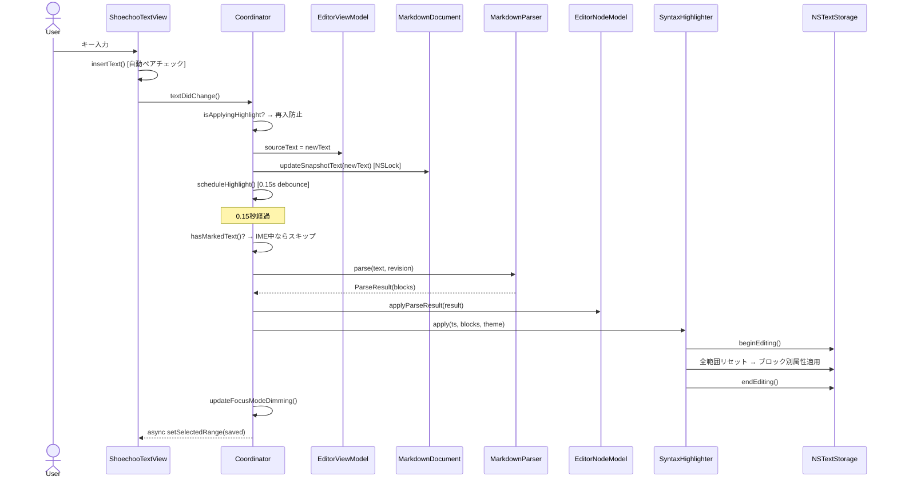
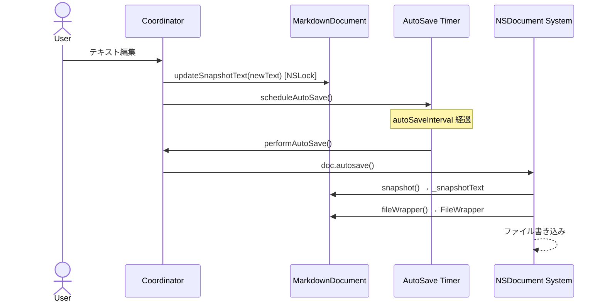
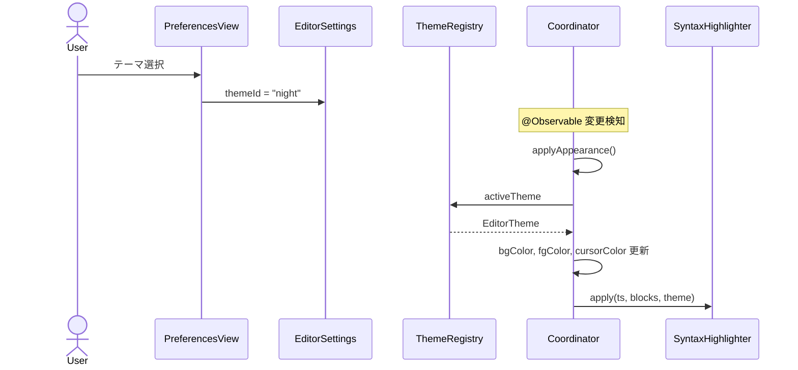
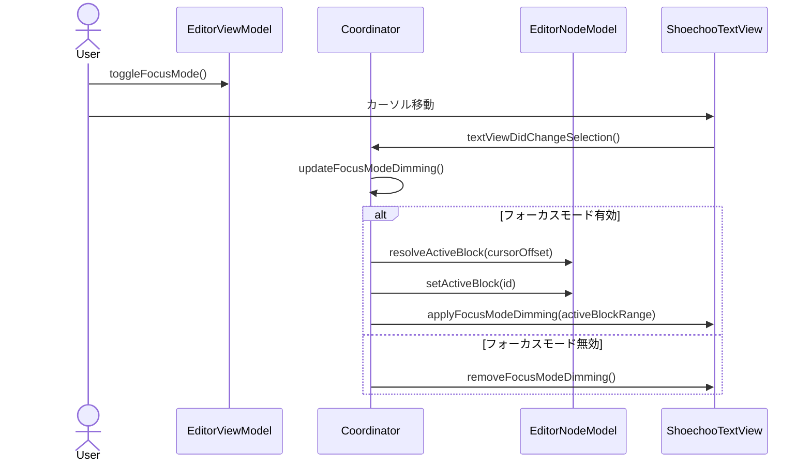
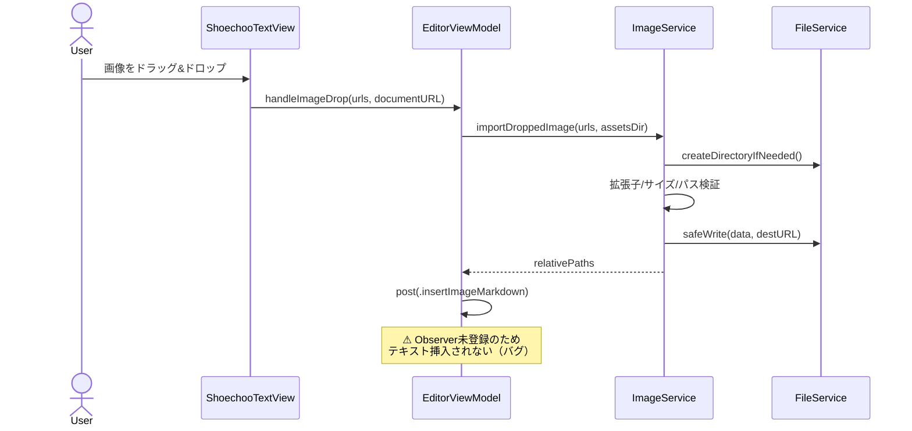
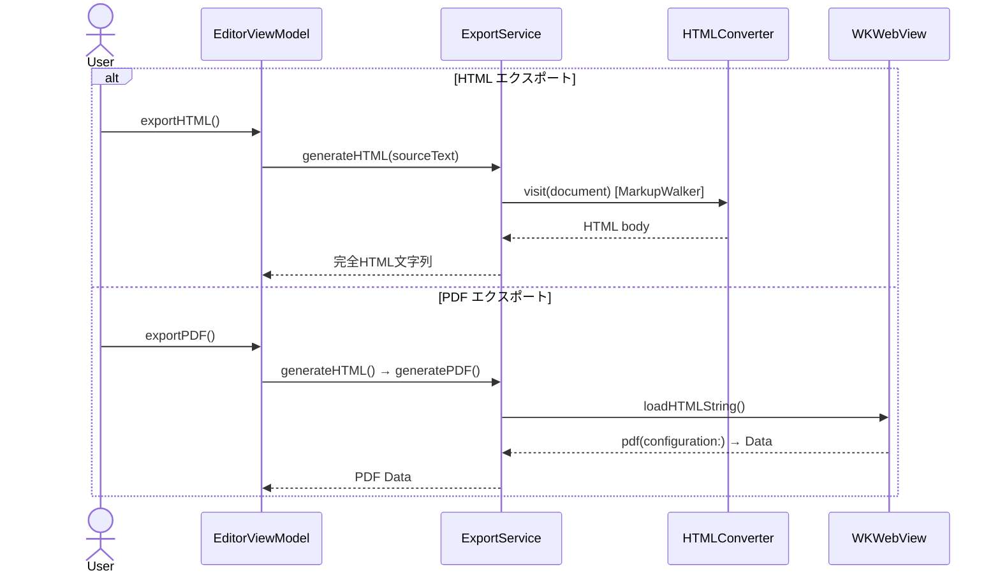

# Interaction Diagrams — shoechoo

## 1. ドキュメント編集フロー

```mermaid
sequenceDiagram
    actor User
    participant TV as ShoechooTextView
    participant C as Coordinator
    participant VM as EditorViewModel
    participant Doc as MarkdownDocument
    participant P as MarkdownParser
    participant NM as EditorNodeModel
    participant SH as SyntaxHighlighter
    participant TS as NSTextStorage

    User->>TV: キー入力
    TV->>TV: insertText() [自動ペアチェック]
    TV->>C: textDidChange()
    C->>C: isApplyingHighlight? → 再入防止
    C->>VM: sourceText = newText
    C->>Doc: updateSnapshotText(newText) [NSLock]
    C->>C: scheduleHighlight() [0.15s debounce]
    Note over C: 0.15秒経過
    C->>C: hasMarkedText()? → IME中ならスキップ
    C->>P: parse(text, revision)
    P-->>C: ParseResult(blocks)
    C->>NM: applyParseResult(result)
    C->>SH: apply(ts, blocks, theme)
    SH->>TS: beginEditing()
    SH->>TS: 全範囲リセット → ブロック別属性適用
    SH->>TS: endEditing()
    C->>C: updateFocusModeDimming()
    C-->>TV: async setSelectedRange(saved)
```

## 2. ファイル保存フロー

```mermaid
sequenceDiagram
    actor User
    participant C as Coordinator
    participant Doc as MarkdownDocument
    participant Timer as AutoSave Timer
    participant macOS as NSDocument System

    User->>C: テキスト編集
    C->>Doc: updateSnapshotText(newText) [NSLock]
    C->>Timer: scheduleAutoSave()
    Note over Timer: autoSaveInterval 経過
    Timer->>C: performAutoSave()
    C->>macOS: doc.autosave()
    macOS->>Doc: snapshot() → _snapshotText
    macOS->>Doc: fileWrapper() → FileWrapper
    macOS-->>macOS: ファイル書き込み
```

## 3. テーマ切替フロー

```mermaid
sequenceDiagram
    actor User
    participant Pref as PreferencesView
    participant Settings as EditorSettings
    participant TR as ThemeRegistry
    participant C as Coordinator
    participant SH as SyntaxHighlighter

    User->>Pref: テーマ選択
    Pref->>Settings: themeId = "night"
    Note over C: @Observable 変更検知
    C->>C: applyAppearance()
    C->>TR: activeTheme
    TR-->>C: EditorTheme
    C->>C: bgColor, fgColor, cursorColor 更新
    C->>SH: apply(ts, blocks, theme)
```

## 4. フォーカスモードフロー

```mermaid
sequenceDiagram
    actor User
    participant VM as EditorViewModel
    participant C as Coordinator
    participant NM as EditorNodeModel
    participant TV as ShoechooTextView

    User->>VM: toggleFocusMode()
    User->>TV: カーソル移動
    TV->>C: textViewDidChangeSelection()
    C->>C: updateFocusModeDimming()
    alt フォーカスモード有効
        C->>NM: resolveActiveBlock(cursorOffset)
        C->>NM: setActiveBlock(id)
        C->>TV: applyFocusModeDimming(activeBlockRange)
    else フォーカスモード無効
        C->>TV: removeFocusModeDimming()
    end
```

## 5. 画像ドロップフロー

```mermaid
sequenceDiagram
    actor User
    participant TV as ShoechooTextView
    participant VM as EditorViewModel
    participant IS as ImageService
    participant FS as FileService

    User->>TV: 画像をドラッグ&ドロップ
    TV->>VM: handleImageDrop(urls, documentURL)
    VM->>IS: importDroppedImage(urls, assetsDir)
    IS->>FS: createDirectoryIfNeeded()
    IS->>IS: 拡張子/サイズ/パス検証
    IS->>FS: safeWrite(data, destURL)
    IS-->>VM: relativePaths
    VM->>VM: post(.insertImageMarkdown)
    Note over VM: ⚠ Observer未登録のため<br/>テキスト挿入されない（バグ）
```

## 6. エクスポートフロー

```mermaid
sequenceDiagram
    actor User
    participant VM as EditorViewModel
    participant ES as ExportService
    participant HC as HTMLConverter
    participant WK as WKWebView

    alt HTML エクスポート
        User->>VM: exportHTML()
        VM->>ES: generateHTML(sourceText)
        ES->>HC: visit(document) [MarkupWalker]
        HC-->>ES: HTML body
        ES-->>VM: 完全HTML文字列
    else PDF エクスポート
        User->>VM: exportPDF()
        VM->>ES: generateHTML() → generatePDF()
        ES->>WK: loadHTMLString()
        WK-->>ES: pdf(configuration:) → Data
        ES-->>VM: PDF Data
    end
```
